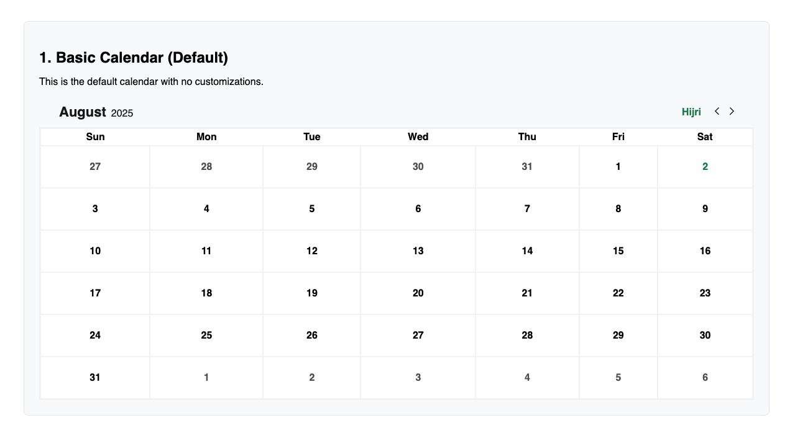
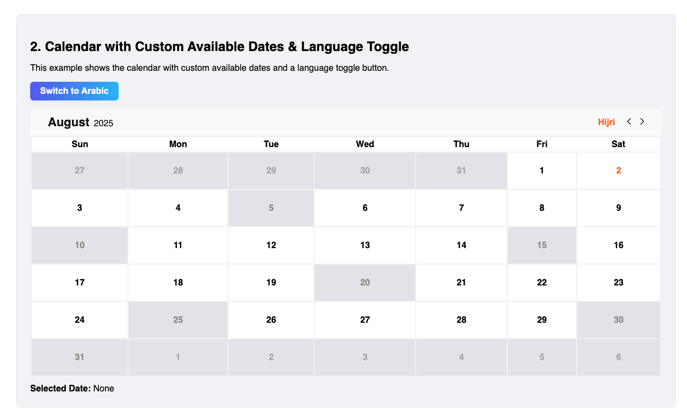
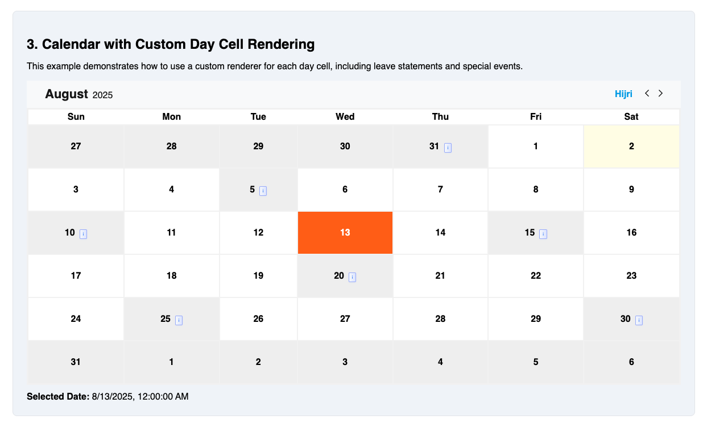
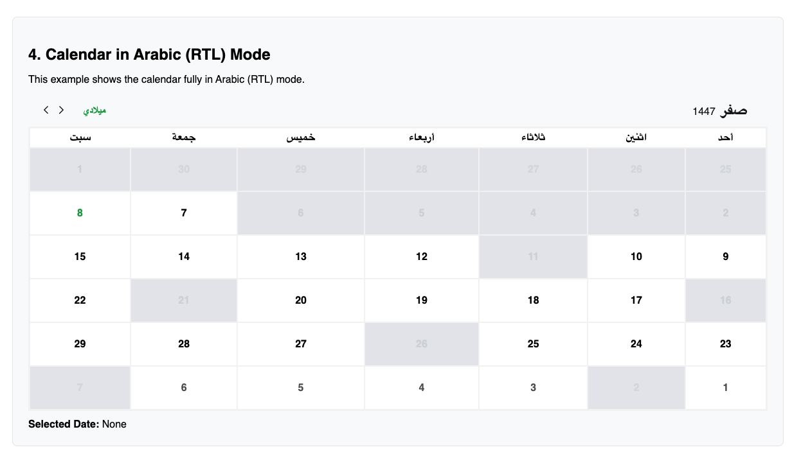

# React Hijri and Gregorian Calendar

A pluggable React calendar component supporting both Hijri and Gregorian dates, theming, and custom rendering.

## Features

- Hijri and Gregorian Calendar
- RTL/LTR and Arabic/English support
- Theming and style overrides
- Custom day cell rendering
- TypeScript support

## Installation

```bash
npm install react-hijri-calendar
```

## Usage

### Example 1: Basic Calendar (Default)



```tsx
import { Calendar } from 'react-hijri-calendar';

function Example1() {
  return <Calendar />;
}
```

### Example 2: Calendar with Custom Available Dates & Language Toggle



```tsx
import { Calendar } from 'react-hijri-calendar';
import { useState } from 'react';

function Example2() {
  const [selectedDate, setSelectedDate] = useState<Date | null>(null);
  const [lang, setLang] = useState<'en' | 'ar'>('en');
  const availableDatesInfo = [
    { date: '20250801', isAvailable: true, leaveStatement: '' },
    // ...
  ];
  return (
    <>
      <button onClick={() => setLang(lang === 'en' ? 'ar' : 'en')}>
        {lang === 'en' ? 'Switch to Arabic' : 'التبديل إلى الإنجليزية'}
      </button>
      <Calendar
        availableDatesInfo={availableDatesInfo}
        initialSelectedDate={selectedDate}
        lang={lang}
        mode="customAvailable"
        primaryColor="#ff6600"
        setSelectedDate={setSelectedDate}
        unavailableColor="#999999"
      />
    </>
  );
}
```

### Example 3: Calendar with Custom Day Cell Rendering



```tsx
import { Calendar } from 'react-hijri-calendar';
import { useState } from 'react';

function Example3() {
  const [selectedDate, setSelectedDate] = useState<Date | null>(null);
  const availableDatesInfo = [
    { date: '20250801', isAvailable: true, leaveStatement: '' },
    // ...
  ];
  return (
    <Calendar
      availableDatesInfo={availableDatesInfo}
      initialSelectedDate={selectedDate}
      lang="en"
      mode="customAvailable"
      primaryColor="#0ea5e9"
      renderDayCell={({
        date,
        isSelected,
        isAvailable,
        isCurrentDay,
        availableCellData,
      }) => (
        <div
          style={{
            backgroundColor: isSelected
              ? '#0ea5e9'
              : isCurrentDay
                ? '#fffde7'
                : isAvailable
                  ? '#fff'
                  : '#f0f0f0',
            color: isSelected ? '#fff' : '#000',
            padding: '28px 4px',
            cursor: isAvailable ? 'pointer' : 'not-allowed',
          }}
        >
          <span>{date.getDate()}</span>
          {availableCellData?.leaveStatement && (
            <span
              style={{
                background: 'linear-gradient(90deg, #f8fafc 0%, #e0e7ff 100%)',
                color: '#3b82f6',
                border: '1px solid #a5b4fc',
                borderRadius: '2px',
                padding: '0.2rem 0.3rem',
                marginLeft: '0.5rem',
                fontWeight: 500,
                fontSize: '0.5em',
                boxShadow: '0 1px 3px rgba(59,130,246,0.07)',
                cursor: 'pointer',
              }}
              title="Leave Statement for national holidays"
            >
              i
            </span>
          )}
        </div>
      )}
      setSelectedDate={setSelectedDate}
      unavailableColor="#e5e7eb"
    />
  );
}
```

### Example 4: Calendar in Arabic (RTL) Mode



```tsx
import { Calendar } from 'react-hijri-calendar';
import { useState } from 'react';

function Example4() {
  const [selectedDate, setSelectedDate] = useState<Date | null>(null);
  const availableDatesInfo = [
    { date: '20250801', isAvailable: true, leaveStatement: '' },
    // ...
  ];
  return (
    <Calendar
      availableDatesInfo={availableDatesInfo}
      initialSelectedDate={selectedDate}
      lang="ar"
      mode="customAvailable"
      primaryColor="#16a34a"
      setSelectedDate={setSelectedDate}
      unavailableColor="#d1d5db"
    />
  );
}
```

## Props

| Prop                | Type                                  | Description                                                                                                               |
| ------------------- | ------------------------------------- | ------------------------------------------------------------------------------------------------------------------------- |
| initialSelectedDate | `Date \| null`                        | Initial selected date (Date object or null)                                                                               |
| setSelectedDate     | `(date: Date) => void`                | Callback to update selected date.                                                                                         |
| availableDatesInfo  | `AvailableDateInfo[]`                 | Array of date info objects (required for `customAvailable` mode)                                                          |
| mode                | `'allAvailable' \| 'customAvailable'` | Calendar selection mode. `'allAvailable'` = all days selectable (default), `'customAvailable'` = only availableDatesInfo. |
| lang                | `'en' \| 'ar'`                        | Language for labels                                                                                                       |
| calendarType        | `'hijri' \| 'gregorian'`              | Force calendar type. If not provided, falls back to `lang` (`'ar'` = Hijri, `'en'` = Gregorian).                          |
| renderDayCell       | `function`                            | Custom day cell renderer                                                                                                  |
| className           | `string`                              | Custom class for main container                                                                                           |
| style               | `React.CSSProperties`                 | Inline styles for main container (supports CSS variables for theming)                                                     |
| dayCellStyle        | `React.CSSProperties`                 | Inline styles for day cells                                                                                               |
| dayCellClassName    | `string`                              | Custom class for day cells                                                                                                |
| primaryColor        | `string`                              | Primary color (overrides default)                                                                                         |
| unavailableColor    | `string`                              | Unavailable color (overrides default)                                                                                     |

## Calendar Type

The `calendarType` prop allows you to explicitly set the calendar system:

- `calendarType="hijri"` — Always use the Hijri calendar
- `calendarType="gregorian"` — Always use the Gregorian calendar
- If not provided, the calendar type falls back to the `lang` prop (`'ar'` = Hijri, `'en'` = Gregorian)

This makes it easy to control the calendar system independently of the language/labels.

## Modes

The `mode` prop controls which days are selectable:

- `allAvailable` (default): All days are available for selection. The `availableDatesInfo` prop is ignored.
- `customAvailable`: Only dates in the `availableDatesInfo` array with `isAvailable: true` are selectable. All other days are disabled.

If `mode` is `customAvailable` and `availableDatesInfo` is missing or empty, all days will be disabled and a warning will be shown in development.

## Theming & Styling

Override colors and styles using the `primaryColor`, `unavailableColor`, `className`, `dayCellStyle`, and `dayCellClassName` props:

```tsx
<Calendar
  primaryColor="#ff6600"
  unavailableColor="#999"
  className="my-calendar"
  dayCellStyle={{ borderRadius: 8 }}
  dayCellClassName="my-day-cell"
  // ...
/>
```

## Custom Day Cell Rendering

```tsx
<Calendar
  renderDayCell={({
    date,
    isSelected,
    isAvailable,
    isCurrentDay,
    availableCellData,
  }) => (
    <div style={{ background: isSelected ? 'gold' : undefined }}>
      {date.getDate()}
      {availableCellData?.leaveStatement && (
        <span>{availableCellData.leaveStatement}</span>
      )}
    </div>
  )}
  // ...
/>
```

## Types

All types are exported from the package:

```ts
import type {
  AvailableDateInfo,
  SetSelectedDateFunc,
} from 'react-hijri-calendar';

export type AvailableDateInfo = {
  date: string; // 'YYYYMMDD' format
  isAvailable: boolean;
  leaveStatement?: string;
  isHalfDay?: boolean;
  note?: string;
};
```

## License

ISC
